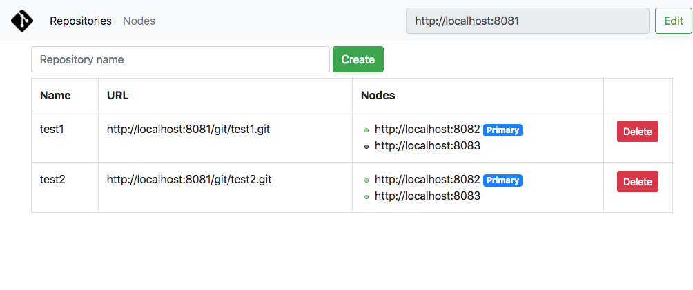

gitmesh
========

## What's this?

This is an experimental project to make a distributed git server cluster. The main goal of this project is to find a reasonable way to add scalability and redundancy to git repositories. Basic idea is locating git repositories on multiple nodes, and proxy requests from git clients to appropriate nodes. This approach is similar to [GitHub's DGit](https://githubengineering.com/introducing-dgit/) (it has been renamed to [Spokes](https://githubengineering.com/building-resilience-in-spokes/)).

The distributed gitserver cluster consists of following two kinds of servers:

- [Controller server](https://github.com/takezoe/gitmesh/tree/master/gitmesh-controller-server)

  This is a front server of the cluster. It manages repository servers and proxy requests from git clients to appropriate repository servers. We can make redundant it by setup multiple instances with a load balancer. 

- [Repository server](https://github.com/takezoe/gitmesh/tree/master/gitmesh-repository-server)

  This is a storage server of the cluster. Git repositories are located on this kind of servers actually. We can add any number of repository server instances to the cluster.


This project is still under development phase, but if you are interested, please try it. Any feedback is welcome!

## Setup

You can run run a minimal gitmesh cluster on docker and docker-compose.

### Prerequisites

- Java 8
- sbt
- Docker

### Build docker images

First, run the following command at the root of this repository to build docker images.

```
$ ./build-docker.sh
```

This script builds following docker images:

- gitmesh-console
- gitmesh-controller-server
- gitmesh-repository-server

### Run a cluster using docker-compose

Next, run the following command to start a minimal gitmesh cluster (console x 1, controller x 1, mysql x 1, repository x 2). 

```
$ ./run-docker-compose.sh
```

This command executes docker-compose internally. So you can run a cluster with another structure by modifying `docker-compose.yml`.

Web console is available at `http://localhost:8080`, and endpoints are available at `http://localhost:8081`. See [this section](#check-the-cluster-operation) to know how you can use a gitmesh cluster as a Git server.

## Build and run from source code

You can also build and run gitmesh from source code for now. This guide shows how to run the cluster with minimum configuration (one controller server and one repository server on a single machine).

### Prerequisites

- Java 8
- sbt
- MySQL

You have to create an empty database before run the controller server. If you use docker, run a MySQL container as follows:

```
$ docker pull mysql
$ docker run --name mysql -e MYSQL_ROOT_PASSWORD=mysql MYSQL_DATABASE=gitmesh -d -p 3306:3306 mysql
```

### Start the controller server

Modify `gitmesh-controller-server/src/main/resources/application.conf` for your environment, and run the controller server as follows:

```
$ cd gitmesh-controller-server
$ sbt ~jetty:start
```

The controller server is started on port 8081 in default. Tables are created automatically in the database configured in `application.conf`.

### Start the repository server

Modify `gitmesh-repository-server/src/main/resources/application.conf` for your environment, and run the repository server as follows:

```
$ cd gitmesh-repository-server
$ sbt ~jetty:start
```

The repository server is started on port 8082 in default.

## Check the cluster operation

Let's create a new repository and push a commit using `git` command to check the cluster operation.

You can create a new repository via Web API. In this case, a repository url is `http://localhost:8081/git/test.git`.

```
$ curl -XPOST http://localhost:8081/api/repos/test
```

Create a local repository and push a first commit to the remote repository on the cluster:

```
$ mkdir test
$ cd test
$ git init
$ touch README.md
$ git add .
$ git commit -m 'first commit'
$ git remote add origin http://localhost:8081/git/test.git
$ git push origin master
```

The remote repository is created under the directory configured in the repository server's `application.conf`.

### Web console

gitmesh also offers a [web console](https://github.com/takezoe/gitmesh/tree/master/gitmesh-console) for administrators.



Run followng commands to start the web console.

```
$ cd gitmesh-console
$ npm install
$ npm run dev
```

The web console is available at http://localhost:8080/. You can check repositories and nodes status, and create or delete repositories on this console.


